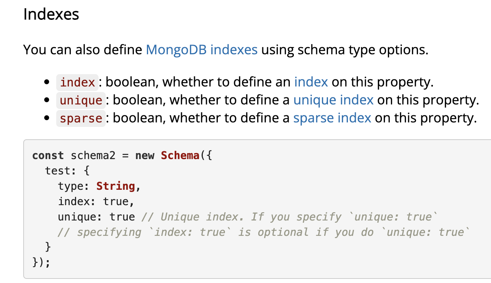
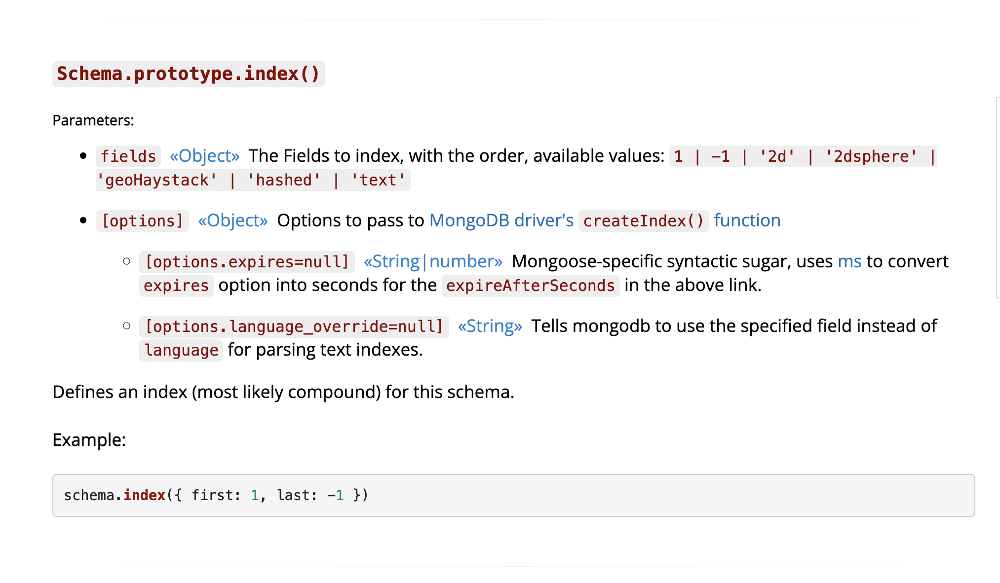
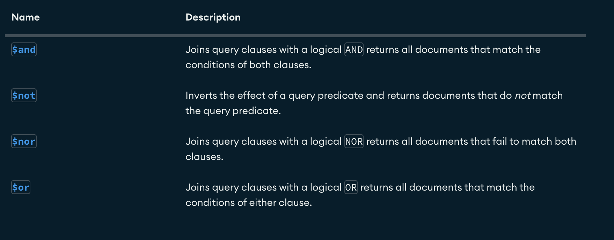
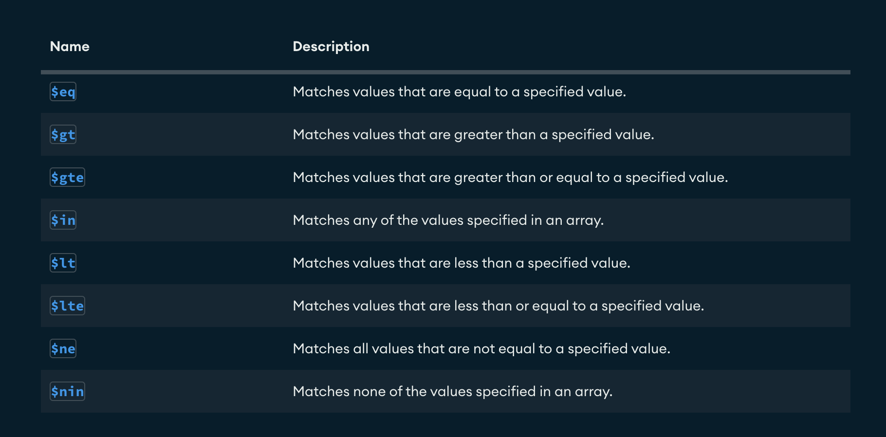
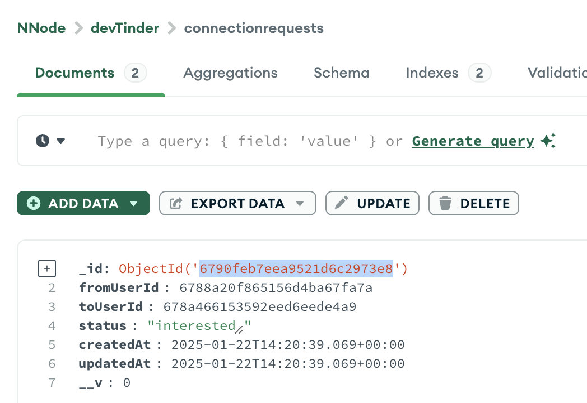

ExpressJs- a framework for NodeJS

To create connfiguration file, package.json

- npm init
  package.json: ( this file is like a INDEX's role in book, its metadata associated with a project )

src/app.js - starting point of your application, main code js file where you'll write nodej/js code

- npm i express
  dependencies: whenever we install/i something, it adds dependecy to our project inside "node_modules" means it added "express" as dependency to our project.

  express: express inside node modules is also dependent on a lot of dependencies( other npm libraries) And other libraries are dependent on other dependencies. All that will be installed.
  "express": "^4.21.2"
  "4.21.2"- without any sign, means project will never update, will run on this particular version.

  ^- caret ( our project will updated automatically if it is 4.x.x)- upto minor updates

  ~- Tilda (our project will updated automatically if it is 4.21.x)- only patch updates

  4- major( it will change only when critical/breaking major change happen, may not be backward versioncompatible)

  21- minor( releasing new minor feature, things will still be backward compatible- means not a major version change )

  2- patch( small change, bugfix, - means very safe change )

  package-lock.json: what actual version i'm using is defined here. package.json is not giving me exact version info your project is running on because it might be auto updated, that info will be present in package-lock.json.

nodemon:to auto restart server after every change in code

- npm i -g nodemon ( global installation)
  nodemon: to auto restart server
  command too run: nodemon src/app.js

S02Ep06

- How to connect your application to your mongo db cluster.

1. Create a config folder inside src
2. Create a database.js file inside the config folder, in this file we will write the logic to connect to database
3. we'll use mongoose library to connect/talk to DB
4. go to mongoose.com and copy the boilerplate code
5. Also mongoose has very good documentation for reference
6. npm i mongoose
7. write logic in the file database.js & import that file inside app.js( require("./config/database"); )

// NOTE: PROPER WAY OF MAKING A DB CONNECTION
// once your DB connection is established
// then only you should do app.listen( 3000, ()=>{})

// that's why first export connectDB function from database.db file
// and import it in app.js( line 2 ) & call connectDB before app.listen

SCHEMA- create inside a models

S02E08
npm validator library- can be used to do validations at schema level
& Sanitization(api level validation)

- npm i validator

S02E09

- passwords should be stored in hashed format/encrypted format
  First thing should be done during /signup:

1. Validation of data( utils/helper funct)
2. Encrypt the password
3. Then Store user in DB

To encrypt/hash passwords & also validate your passwords

- npm i bcrypt

S02E10

- there are certain APIs which can be accessed only after the authentication/logged in.
- COOKIE: when you're loggin in an application & calling a login API, then server validates( email & password ) & then authenticates & sends back a response along with JWT token inside the COOKIE. Then browser will store that cookie, whenever user is making any(like, comment, post, patch) API call, browser will send that cookie along with request, then this cookie will validated & proper response(data etc) will send back to browser.
- Suppose after sometime, On every API call, this cookie(JWT token) will be validated.
- cookie EXPIRE: you can also expire your cookies which holds JWT token & other things
- EXPIRY: we can set expiry date of JWT token to any time( 0d,1d, 1w, 1m etc)
- 0d: expires immediatly once the token is created
- AUTHENTICATION/VALIDATION FAILED: When JWT token is expired & you're making an API call, then it won't work & you'll have to login again.

cookie-parser: is used to read cookies

- npm i cookie-parser

JWT: JSON wen token, is JSON Object which is used to securely transfer information over the web(between two parties).

- npm i jsonwebtoken
  It is made of 3 parts:

1. Header
2. Payload/data
3. Signature

- Auth Middleware(userAuth): is needed because we want all( except /signin & /login) the APIs to work after authentication
- use userSchema methods in user.js to generate jwt token & bcrypt.compare instead in app.js, as it is re-usable, testable etc
- if this is being used to point to the instance of user, then avoid using arrow function as this doesn't work well with arrow function. where user/this can be Akash or Elon

S02E11

- use express.router() to handle( grouped & manage apis effieciently) routing in a proper way

S02E12

- two entities(userSchema) has its own schema, and relationship(connection) between them should have its own schema ie. connectionRequestSchema

- similar to schemaMethods in episode S02E10, we can create schema level Validation using mongoose schema pre for checking/validating (3. you can't send request to yourself as well)
- If any pre hook errors out, mongoose will not execute subsequent middleware or the hooked function. Mongoose will instead pass an error to the callback and/or reject the returned promise. There are several ways to report an error in middleware( DONT USE ARROY FUNCTION)
- pre is like a middleware and will be called everytime the connection request gets save in DB ie when save() method will be called ie. await connectionRequest.save();
- connectionSchema.pre("save", function(){}), where save is like a event/eventhandler- ie. before save() , pre will be called
- since it is kind of like middleware, so pass next() as well

- putting index in DB because
- Imagine a scenario where 1000 people are in DB
- Suppose every person is sending 100 connection request( 1000 x 100 entries in connectionrequests collection/table)
- Query(User.findOne) operation becomes expensive as collection/table grows( 1000 x 100 ) or in case of million of users
- <!-- - eg: await  ConnectionRequestModel.findOne({
  //mongoose/mongodb OR
  $or: [
  //Conditions
  { fromUserId, toUserId },
  { fromUserId: toUserId, toUserId: fromUserId },
  ],
  }); -->
<!--
  or
  findByName etc -->
- to handle this situation you need indexes in DB
- Indexing DB makes API faster
- putting index on emailId as this is what we're doing for long time
- NOTE: if you're making any field(eg:emailID) unique, then mongoDB automatically creates index for that
  
- other way- index, unique, sparse: true
- since we're quering using both fromUserId and toUserId, we need to index them both ie. COMPOUND INDEX
- COUMPOUND INDEX eg- connectionRequestSchema.index({ fromUserId: 1, toUserId: 1 });
  
- Creating indexes unnecessarly also comes at a cost, so be mindful about it.
- Indexes implementation is different in MongoDB & SQL
- Advantage of creating index
- Disadvantage of creating lot of index
- Logical Queries
  
- Comparision Queries
  
- ALWAYS THINK ABOUT CORNER CASES WHILE CREATING API

S02E13

- Akash => Elon(fromUserId => toUserId) - a connection request was sent using POST /request/send/:status/:toUserId
- "/request/review/:status/:requestId" WHILE CREATING THIS API
- Remember that loggedIn user should matching toUserId, then only this API should work
- only toUserId should be able to accepted/rejected the request
- accepted/rejected can only happen if status of POST /request/send/:status/:toUserId is "interested"
- ( if the status is "ignored" then it can't be accepted or rejected)
- requestId should be valid/ present in our DB
- requestId
  

- Thought process of POST api is very different from GET api
- POST- saving data into DB
- How can a attacker exploit POST api ?
- By sending some random data into API & mistakingly saving data in DB
- GET- fetching data from DB
- we'll make sure that we'll only send allowed data to user/attacker ie. whoever has logged in can only
- get data related to his/her logged in ID ( which is allowed in his/her scope)
- Avoid Data leaks

- BUILDING RELATION BEWTWEEN TWO COLLECTION/TABLE[ users(User)& connectionrequets(ConnectionRequest)]
- 1. by creating a reference between them using "ref"( ref: "User") in connectionRequest.js under fromUserId
- 2. .populate("fromUserId") - TO POPULATE ALL THE DATA OR .populate("fromUserId",["firstName","lastName"]) -TO POPULATE SPECIFIC DATA in routes/user.js UNDER /user/requests/received API
- NOTE: using "ref" and "populate", we're basically joining two collection/table like we used to do in SQL
- mongoose IDs don't get compared with ===..... use toString() OR fromUserId.equals(toUserId)

S02E14

- user should see all the cards except:
- 1. His own card
- 2. His connections / he accepted/ he got rejected (connection status: "accepted")
- 3. He rejected / He got rejected (connection status: "rejected")
- 4. He Ignored people / He got Ignored by People (connection status: "ignored")
- 5. He already sent the connection request / He already received connection request (connection status: "interested")

- [Rahul, Akash, Elon, Mark, Donald, MS Dhoni, Virat]
- Example: What Rahul will see in his feed(array)
- Rahul -> Akash -> "rejected", Rahul -> Elon ->"accepted"
- Rahul = [Mark, Donald, MS Dhoni, Virat]
- Elon = [ Akash, Mark, Donald, MS Dhoni, Virat]
- Akash = [ Elon, Mark, Donald, MS Dhoni, Virat]
- Virat = [Rahul, Akash, Elon, Mark, Donald, MS Dhoni]

- set datastructure is like an array which only contains unique elements & it will skip any duplicate if you try to push

- using comparison query in mongoDB
- $ne: Matches all values that are not equal to a specified value.
- $nin: Matches none of the values specified in an array.

- Pagination:
- /feed?page=1&limit=10 => 1-10 ie. .skip(0) & .limit(10)
- /feed?page=2&limit=10 => 11-20 ie. .skip(10) & .limit(10)
- /feed?page=3&limit=10 => 21-30 ie. .skip(20) & .limit(10)

- skip formula = (page-1)xlimit

- .skip() -how many documents you skip from the starting
- .limit() -how many documents we want

- params /feed/:page
- query /feed?page=1
